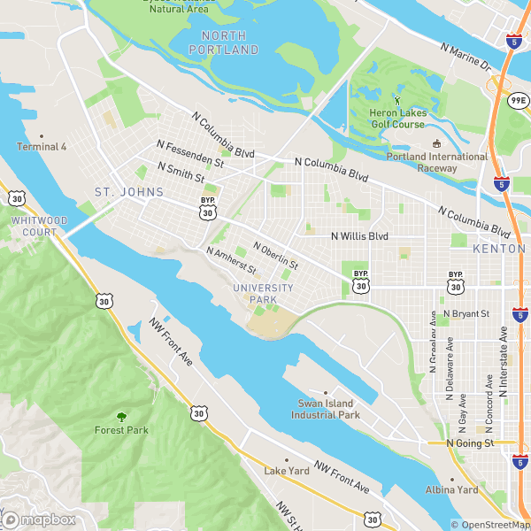
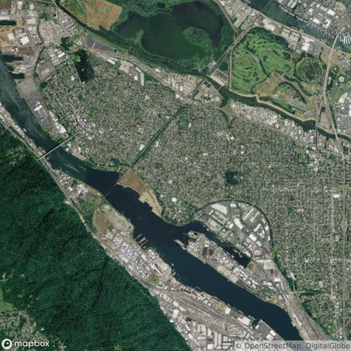
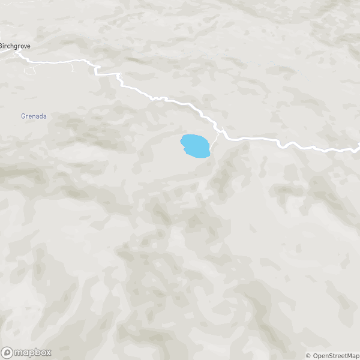
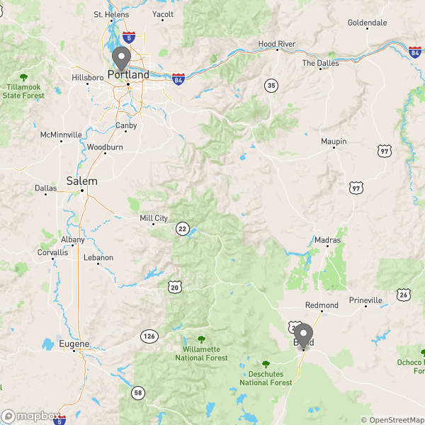

# Static API for Styles

```python
>>> from mapbox import StaticStyle

```

See https://www.mapbox.com/api-documentation/#static for general documentation
of the API.

Your Mapbox access token should be set in your environment; see the [access
tokens](access_tokens.md) documentation for more information.

## StaticStyle methods

The methods of the `StaticStyle` class that provide access to the Static Maps API
return an instance of
[`requests.Response`](http://docs.python-requests.org/en/latest/api/#requests.Response).
Its `content()` method returns the raw bytestring that can be saved into an
image file with the appropriate extension.

## Usage

To render a mapbox style to a static image, create a `StaticStyle` instance

```python
>>> service = StaticStyle()

```

```python
>>> response = service.image(
...     username='mapbox',
...     style_id='streets-v9',
...     lon=-122.7282, lat=45.5801, zoom=12)
>>> response.status_code
200
>>> response.headers['Content-Type']
'image/png'

```

The contents can be written to file as an `image/png` file

```python
>>> with open('/tmp/static.png', 'wb') as output:
...     _ = output.write(response.content)

```

The result




Styles with raster data are delivered as `image/jpeg`

```python
>>> response = service.image(
...     username='mapbox',
...     style_id='satellite-v9',
...     lon=-122.7282, lat=45.5801, zoom=12)
>>> response.status_code
200
>>> response.headers['Content-Type']
'image/jpeg'
>>> with open('/tmp/static.jpg', 'wb') as output:
...     _ = output.write(response.content)

```



Because the styles are rendered by the GL engine (TODO link) we can
specify pitch, bearing, and decimal zoom levels.

```python
>>> response = service.image(
...     username='mapbox',
...     style_id='streets-v9',
...     lon=-122.7282, lat=45.5801, zoom=12,
...     pitch=45.0, bearing=277.5)
>>> with open('/tmp/static_pitch.png', 'wb') as output:
...     _ = output.write(response.content)

```

The result




Static maps can also display GeoJSON overlays and the
[simplestyle-spec](https://github.com/mapbox/simplestyle-spec) styles will be
respected and rendered.

```python
>>> portland = {
...    'type': 'Feature',
...    'properties': {'name': 'Portland, OR'},
...    'geometry': {
...        'type': 'Point',
...        'coordinates': [-122.7282, 45.5801]}}
>>> bend = {
...    'type': 'Feature',
...    'properties': {'name': 'Bend, OR'},
...    'geometry': {
...        'type': 'Point',
...        'coordinates': [-121.3153, 44.0582]}}

```

If features are provided the map image will be centered on them and will
cover their extents.

```python
>>> response = service.image(
...     username='mapbox',
...     style_id='streets-v9',
...     features=[portland, bend])
>>> with open('/tmp/static_features.png', 'wb') as output:
...     _ = output.write(response.content)

```




See ``import mapbox; help(mapbox.StaticStyle)`` for more detailed usage.
